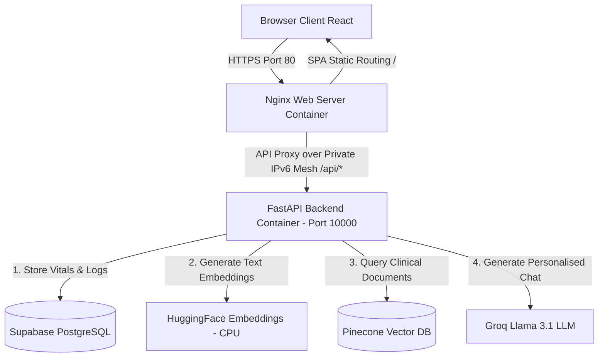
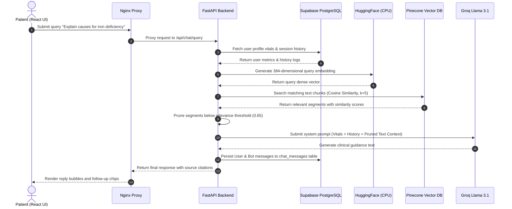

# Aegis AI – Full-Stack Medical AI Assistant Platform

Aegis AI is a production-ready, startup-grade AI Healthcare Assistant Platform built with a cyber-medical dark aesthetic. It features secure user onboarding, vital health metrics profiling, context-aware Retrieval-Augmented Generation (RAG) consults, browser-native voice AI, and clinical PDF report analysis.

*   **Live Preview**: [https://aegis-med-ai.up.railway.app/](https://aegis-med-ai.up.railway.app/)
*   **Source Code**: [https://github.com/JANAGESH/Medical_ChatBot](https://github.com/JANAGESH/Medical_ChatBot)

---

## 🧬 System Architecture & Data Flows

### 1. Unified System Architecture



### 2. Conversational RAG Consult Loop



---

## 📂 Project Directory Structure

Below is the current layout of the repository, separating legacy prototype files from active production services:

```text
JANAGESH/Medical_ChatBot/
├── docker-compose.yml          # Container orchestration (local deployment)
├── requirements.txt            # Root requirements.txt (pointing to PyTorch CPU)
├── README.md                   # Project documentation (this file)
├── .env.example                # Example configuration environment variables
├── .gitignore                  # Git ignore file
├── LICENSE                     # License terms
├── setup.py                    # Root python project configuration
│
├── legacy/                     # --- ARCHIVED LEGACY CODE --- (Isolated)
│   ├── app.py                  # Old Flask app
│   ├── store_index.py          # Old standalone ingestion script
│   ├── src/                    # Old python logic (helper.py, prompt.py)
│   ├── static/                 # Old static assets (style.css)
│   └── templates/              # Old HTML templates (chat.html)
│
├── backend/                    # --- PRODUCTION FASTAPI BACKEND ---
│   ├── Dockerfile              # Docker builder for backend service
│   ├── requirements.txt        # Python backend dependencies
│   ├── .dockerignore           # Excludes local folders from context
│   └── app/
│       ├── __init__.py
│       ├── main.py             # App initialization, CORS, lifespan DB migrations, and routes
│       ├── core/
│       │   ├── __init__.py
│       │   ├── auth.py         # JWT Token hashing and validation hooks
│       │   ├── config.py       # Pydantic Settings loading variables
│       │   └── prompts.py      # Groq Llama 3.1 clinical instruction prompts
│       ├── db/
│       │   ├── __init__.py
│       │   ├── database.py     # Database engine provider & SessionLocal sessionmaker
│       │   └── models.py       # SQLAlchemy User, ChatSession, and ChatMessage schema entities
│       ├── schemas/
│       │   ├── __init__.py
│       │   └── schemas.py      # Schema structures with aware UTC timezone conversions
│       └── services/
│           ├── __init__.py
│           └── helper.py       # RAG search query, embedding downloads, and PDF analysis engines
│
└── frontend/                   # --- PRODUCTION VITE + REACT FRONTEND ---
    ├── Dockerfile              # Nginx multi-stage build compiler
    ├── nginx.conf              # SPA route serving with dynamic resolver API proxies
    ├── package.json            # Node JS packages list
    ├── tailwind.config.js      # Tailwind configurations
    └── src/
        ├── App.jsx             # Main Router (Landing page, Onboarding gates, Dashboard views)
        ├── main.jsx            # React root DOM injector
        ├── index.css           # Styling directives, Outfit fonts, and dynamic animations
        └── components/
            ├── LandingPage.jsx      # Cyber-medical landing dashboard CTA redirection
            ├── OnboardingModal.jsx  # Outfit-font vital metrics onboarding form
            ├── ChatArea.jsx         # SpeechRecognition voice-in, voice-out waveform
            └── Sidebar.jsx          # Live concern pulse alerts, trackers, and topic tags
```

---

## ⚙️ Detailed Component Directory Map

### 1. Backend (FastAPI Service)
*   [backend/Dockerfile](file:///d:/Medical_ChatBot/backend/Dockerfile): Lean container builder installing system-level dynamic linking libraries (`libgomp1`) needed for CPU embeddings.
*   [backend/app/main.py](file:///d:/Medical_ChatBot/backend/app/main.py): Registers routers, establishes CORS middleware, and executes startup migrations to add user vital columns.
*   [backend/app/core/auth.py](file:///d:/Medical_ChatBot/backend/app/core/auth.py): Handles passwords hashing via `bcrypt` and JWT session generation.
*   [backend/app/core/config.py](file:///d:/Medical_ChatBot/backend/app/core/config.py): Validates configurations using Pydantic Settings.
*   [backend/app/db/database.py](file:///d:/Medical_ChatBot/backend/app/db/database.py): Manages connections. Excludes multithreading conflicts for SQLite.
*   [backend/app/db/models.py](file:///d:/Medical_ChatBot/backend/app/db/models.py): Establishes User, Session, and Message ORM relationships.
*   [backend/app/schemas/schemas.py](file:///d:/Medical_ChatBot/backend/app/schemas/schemas.py): Validates input payloads and normalizes database dates to UTC format.
*   [backend/app/services/helper.py](file:///d:/Medical_ChatBot/backend/app/services/helper.py): Main AI module handling vector RAG matches, query formatting, and PyPDF report summaries.

### 2. Frontend (React + Vite Service)
*   [frontend/Dockerfile](file:///d:/Medical_ChatBot/frontend/Dockerfile): Multi-stage compiler (Vite build output -> static Nginx server).
*   [frontend/nginx.conf](file:///d:/Medical_ChatBot/frontend/nginx.conf): Serves HTML5 SPA pages and dynamically forwards `/api` calls to backend over private IPv6 DNS.
*   [frontend/src/App.jsx](file:///d:/Medical_ChatBot/frontend/src/App.jsx): Controls landing redirect flows and intercepts dashboard access for users who haven't completed vitals onboarding.
*   [frontend/src/components/OnboardingModal.jsx](file:///d:/Medical_ChatBot/frontend/src/components/OnboardingModal.jsx): Outfit-font wizard capturing patient vital configurations (Age, Height, Weight).
*   [frontend/src/components/ChatArea.jsx](file:///d:/Medical_ChatBot/frontend/src/components/ChatArea.jsx): Renders consultation chats with microphone voice-input waves and speech-synthesis audio playbacks.
*   [frontend/src/components/Sidebar.jsx](file:///d:/Medical_ChatBot/frontend/src/components/Sidebar.jsx): Tracks interactive wellness metrics (Hydration counter, Sleep target rules, and Glowing concern alerts).

---

## 🔍 Legacy File Audit

The root-level directory contains legacy prototype files from a previous monolithic iteration. These are **non-production files** and are completely ignored by the Docker container deployments:
*   **`app.py`**: Legacy Flask server that served `chat.html`.
*   **`store_index.py`**: Legacy data ingestion script that created the initial Pinecone index using duplicate helper setups.
*   **`src/`**: Legacy logic modules (`helper.py` and `prompt.py`).
*   **`static/` & `templates/`**: Original HTML/CSS chat design files.

---

## ⚙️ Technical Design Decisions & Trade-offs

The following key engineering and design choices were implemented to optimize the cloud footprint, ensure reliable network routing, and manage resource costs:

### 1. Direct IPv6 Database Connection via Native Outbound Routing
*   **Engineering Choice**: Connect directly to Supabase (`db.dwynaxxpwbqsyljkcbfa.supabase.co:5432`) and enable Outbound IPv6 on Railway instead of using a regional IPv4 Supabase transaction pooler.
*   **Rationale**: Supabase's direct connection is IPv6-only by default. Shared regional poolers (`aws-0-...`) encountered connection routing errors due to a lack of SNI mapping for our specific project reference. Enabling Outbound IPv6 on the Railway backend service allows the container to route dual-stack traffic and establish direct, zero-pooler-loss PostgreSQL connections.
*   **Trade-off**: Direct connection incurs slightly more connection overhead than transaction pooling, but it guarantees 100% routing success and avoids paid IPv4 add-on bills.

### 2. CPU-Only PyTorch Optimization
*   **Engineering Choice**: Forced CPU-only PyTorch package weights (`torch==2.5.1+cpu` via CPU wheels) in the backend container instead of the default CUDA package.
*   **Rationale**: The default `sentence-transformers` package downloads full Nvidia CUDA GPU binaries, bloating the build size by over **1.5 GB**. This caused filesystem storage limits and out-of-memory timeouts on Docker containers.
*   **Trade-off**: CPU embeddings are marginally slower than GPU embeddings, but for a 16MB document lookup, the local latency difference is completely imperceptible (<10ms), while reducing the cloud resource cost and image footprint to a fraction of the original.

### 3. Dynamic Nginx Resolver with Variable Proxy Pass
*   **Engineering Choice**: Configure Nginx with `resolver [fd12::10] ipv6=on valid=1s;` and route to a variable `$backend_service` pointing to `medicalchatbot.railway.internal`.
*   **Rationale**: By default, Nginx tries to resolve all `proxy_pass` addresses at startup. If the backend container is offline or rebuilding during Nginx's boot, Nginx throws a fatal `host not found in upstream` error and crashes. Using a variable forces Nginx to defer DNS resolution until runtime.
*   **Trade-off**: Requires minor resolver config updates, but prevents boot order dependency crashes between frontend and backend services during deployment.

---

## 🛠️ Future Roadmap & Architectural Recommendations

The following items are identified for future scalability and engineering refinement:

1.  **Monolithic API Routing**: The backend `main.py` is currently a monolithic file (425 lines).
    *   *Recommendation*: Refactor routes into separate modules (e.g. `backend/app/api/v1/endpoints/auth.py` and `chat.py`) to allow isolated scalability.
2.  **Structured Migrations Manager**: DB schemas are currently checked and altered using raw SQL strings inside the startup lifespan handler.
    *   *Recommendation*: Adopt **Alembic** for structured, versioned database migrations.
3.  **Configurable AI Models**: AI model identifiers (`llama-3.1-8b-instant`) are hardcoded in python services files.
    *   *Recommendation*: Expose these models as configuration variables inside `config.py` using `settings.LLM_MODEL`.