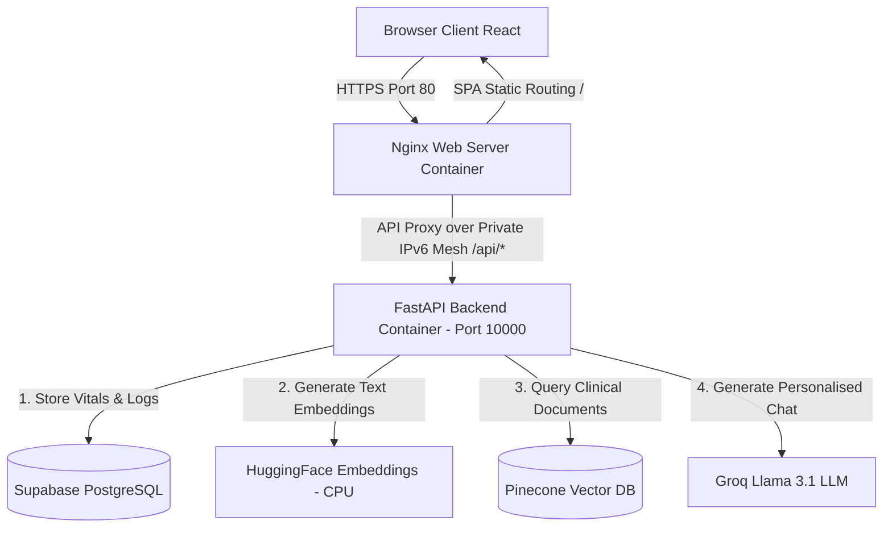
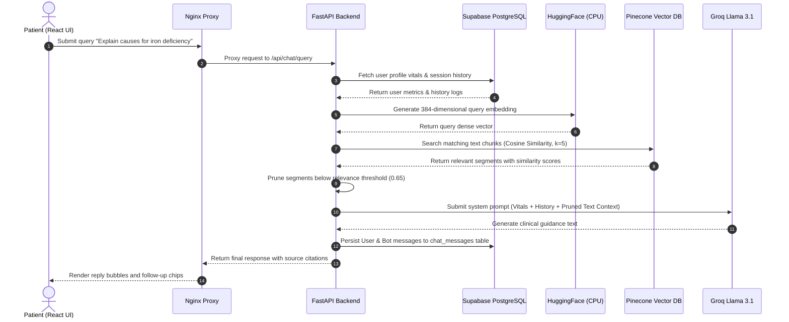

# Aegis AI – Full-Stack Medical AI Assistant Platform

Aegis AI is a production-ready, startup-grade AI Healthcare Assistant Platform built with a cyber-medical dark aesthetic. It features secure user onboarding, vital health metrics profiling, context-aware Retrieval-Augmented Generation (RAG) consults, browser-native voice AI, and clinical PDF report analysis.

*   **Live Preview**: [https://aegis-med-ai.up.railway.app/](https://aegis-med-ai.up.railway.app/)
*   **Source Code**: [https://github.com/JANAGESH/Medical_ChatBot](https://github.com/JANAGESH/Medical_ChatBot)

---

## 🧬 System Architecture & Data Flows

### 1. Unified System Architecture



### 2. Conversational RAG Consult Loop



---

## 🚀 Core Platform Features & Implementation Details

I built this platform to show how we can merge modern conversational AI with robust, secure healthcare state management. Here is a detailed breakdown of how each core feature is implemented:

### 1. Clinical Vital Metrics Onboarding & Profiling
* **Frontend Wizard**: Inside [OnboardingModal.jsx](file:///d:/Medical_ChatBot/frontend/src/components/OnboardingModal.jsx), I built a premium, glassmorphic multi-step wizard using Outfit typography. It captures the patient's name, Date of Birth, gender, height, and weight with animated slider bars and interactive selection tags.
* **Onboarding Gate / Router**: Updated [App.jsx](file:///d:/Medical_ChatBot/frontend/src/App.jsx) to intercept navigation. If an authenticated user attempts to access the main consultation workspace but has not filled out their medical profile, the application automatically redirects them to complete the onboarding steps first.
* **Backend Database Migrations**: Upon completing onboarding, a `PUT` request is made to `/api/auth/profile`. In the backend, the database lifespan event manager in [main.py](file:///d:/Medical_ChatBot/backend/app/main.py) dynamically inspects the database at startup and runs automatic migrations to add these vital columns (`dob`, `gender`, `height`, `weight`) to the users table without risking data loss.
* **Age Calculation Service**: The backend calculates the patient's age on-the-fly from their Date of Birth string using Python's `datetime` utilities, ensuring it is always up-to-date.

### 2. Context-Aware Conversational RAG & Memory
* **Query Ingestion**: When the user sends a query (e.g., *“What are symptoms of iron deficiency?”*), it is received at `/api/chat/query`.
* **Profile & History Injections**: The backend retrieves the user's vitals (age, height, weight, gender) and recent consultation logs from the database. It then formats and injects this information directly into the LLM system prompt as context.
* **Vector Semantic Retrieval**: The query is vectorized into a 384-dimensional dense embedding using HuggingFace's CPU-optimized `all-MiniLM-L6-v2` transformer model. It then performs a cosine similarity lookup against our Pinecone vector index.
* **Similarity Thresholding & Fallback**: To ensure absolute clinical safety, retrieved context segments are pruned if their similarity score falls below `0.65`.
  * *If matches are found*: The relevant medical text is formatted as ground-truth context.
  * *If no matches are found*: The system gracefully falls back to a clean Llama 3.1 consult, utilizing its clinical intelligence to respond naturally.
* **Citations & Message Logging**: The generated response is returned alongside structured citations (source document and page numbers). The entire exchange is immediately logged in the `chat_messages` table under the active `session_id`.

### 3. Browser-Native Voice AI (STT & TTS)
* **Speech-to-Text (STT)**: Built into [ChatArea.jsx](file:///d:/Medical_ChatBot/frontend/src/components/ChatArea.jsx) using the browser's native Web Speech API (`webkitSpeechRecognition`). A microphone toggle on the chat bar lets patients dictate queries aloud, with an animated CSS keyframe waveform highlighting active listening states.
* **Text-to-Speech (TTS)**: Built a synthesizer trigger next to every bot reply. Clicking it invokes the browser's `speechSynthesis` API with a warm, calm clinical tone configuration, providing accessibility for visually-impaired or elderly patients.

### 4. Interactive Wellness Widgets (Right Sidebar)
* **Hydration Tracker**: Implemented a stateful glass water meter that increments in steps of `250 ml` up to a target of `2000 ml`, storing progress locally.
* **Sleep Advisor**: Dynamically calculates and displays the healthy sleep hours guideline based on the patient's calculated age.
* **Glowing Symptom Risk Guidance**: A real-time script scans the consultation conversation keywords for flags (e.g., *“chest pain”*, *“breathless”*). It dynamically updates the alert badge status from *Low Concern* to *Monitor Symptoms*, *Moderate Concern*, or *Seek Medical Attention*, using a red/orange glowing pulse.
* **Symptom Tracker Tags**: Automatically extracts and displays keywords of current symptoms discussed during the session in the right sidebar.

### 5. Lab Report PDF Ingestion & Summarization
* **File Upload Portal**: Patients can drag and drop clinical PDF reports into the chat area. The UI displays a simulated uploading state (0% to 100%) to indicate parsing progress.
* **Server-Side Extraction**: The PDF is processed as a multipart file upload at `/api/chat/upload` and parsed using Python's `pypdf` library.
* **Groq Llama Summarizer**: The raw text is passed to the Llama model with instructions to extract vital parameters, highlight out-of-range values with safety warnings, and output a concise, bulleted clinical summary.

### 6. Dynamic Session Title Auto-Generation
* **Background Summarization**: When a patient initiates a new session and sends their first message, the backend fires a concurrent call to Groq Llama to generate a concise, 3-to-4 word summary title (e.g. *“Iron Deficiency Guidance”*).
* **Sidebar Update**: The backend updates the session title in the database and returns it, allowing the frontend sidebar to update the list of sessions instantly.


---

## 📂 Project Directory Structure

Below is the current layout of the repository, separating legacy prototype files from active production services:

```text
JANAGESH/Medical_ChatBot/
├── docker-compose.yml          # Container orchestration (local deployment)
├── requirements.txt            # Root requirements.txt (pointing to PyTorch CPU)
├── README.md                   # Project documentation (this file)
├── .env.example                # Example configuration environment variables
├── .gitignore                  # Git ignore file
├── LICENSE                     # License terms
├── setup.py                    # Root python project configuration
│
├── legacy/                     # --- ARCHIVED LEGACY CODE --- (Isolated)
│   ├── app.py                  # Old Flask app
│   ├── store_index.py          # Old standalone ingestion script
│   ├── src/                    # Old python logic (helper.py, prompt.py)
│   ├── static/                 # Old static assets (style.css)
│   └── templates/              # Old HTML templates (chat.html)
│
├── backend/                    # --- PRODUCTION FASTAPI BACKEND ---
│   ├── Dockerfile              # Docker builder for backend service
│   ├── requirements.txt        # Python backend dependencies
│   ├── .dockerignore           # Excludes local folders from context
│   └── app/
│       ├── __init__.py
│       ├── main.py             # App initialization, CORS, lifespan DB migrations, and routes
│       ├── core/
│       │   ├── __init__.py
│       │   ├── auth.py         # JWT Token hashing and validation hooks
│       │   ├── config.py       # Pydantic Settings loading variables
│       │   └── prompts.py      # Groq Llama 3.1 clinical instruction prompts
│       ├── db/
│       │   ├── __init__.py
│       │   ├── database.py     # Database engine provider & SessionLocal sessionmaker
│       │   └── models.py       # SQLAlchemy User, ChatSession, and ChatMessage schema entities
│       ├── schemas/
│       │   ├── __init__.py
│       │   └── schemas.py      # Schema structures with aware UTC timezone conversions
│       └── services/
│           ├── __init__.py
│           └── helper.py       # RAG search query, embedding downloads, and PDF analysis engines
│
└── frontend/                   # --- PRODUCTION VITE + REACT FRONTEND ---
    ├── Dockerfile              # Nginx multi-stage build compiler
    ├── nginx.conf              # SPA route serving with dynamic resolver API proxies
    ├── package.json            # Node JS packages list
    ├── tailwind.config.js      # Tailwind configurations
    └── src/
        ├── App.jsx             # Main Router (Landing page, Onboarding gates, Dashboard views)
        ├── main.jsx            # React root DOM injector
        ├── index.css           # Styling directives, Outfit fonts, and dynamic animations
        └── components/
            ├── LandingPage.jsx      # Cyber-medical landing dashboard CTA redirection
            ├── OnboardingModal.jsx  # Outfit-font vital metrics onboarding form
            ├── ChatArea.jsx         # SpeechRecognition voice-in, voice-out waveform
            └── Sidebar.jsx          # Live concern pulse alerts, trackers, and topic tags
```

---

## ⚙️ Detailed Component Directory Map

### 1. Backend (FastAPI Service)
*   [backend/Dockerfile](file:///d:/Medical_ChatBot/backend/Dockerfile): Lean container builder installing system-level dynamic linking libraries (`libgomp1`) needed for CPU embeddings.
*   [backend/app/main.py](file:///d:/Medical_ChatBot/backend/app/main.py): Registers routers, establishes CORS middleware, and executes startup migrations to add user vital columns.
*   [backend/app/core/auth.py](file:///d:/Medical_ChatBot/backend/app/core/auth.py): Handles passwords hashing via `bcrypt` and JWT session generation.
*   [backend/app/core/config.py](file:///d:/Medical_ChatBot/backend/app/core/config.py): Validates configurations using Pydantic Settings.
*   [backend/app/db/database.py](file:///d:/Medical_ChatBot/backend/app/db/database.py): Manages connections. Excludes multithreading conflicts for SQLite.
*   [backend/app/db/models.py](file:///d:/Medical_ChatBot/backend/app/db/models.py): Establishes User, Session, and Message ORM relationships.
*   [backend/app/schemas/schemas.py](file:///d:/Medical_ChatBot/backend/app/schemas/schemas.py): Validates input payloads and normalizes database dates to UTC format.
*   [backend/app/services/helper.py](file:///d:/Medical_ChatBot/backend/app/services/helper.py): Main AI module handling vector RAG matches, query formatting, and PyPDF report summaries.

### 2. Frontend (React + Vite Service)
*   [frontend/Dockerfile](file:///d:/Medical_ChatBot/frontend/Dockerfile): Multi-stage compiler (Vite build output -> static Nginx server).
*   [frontend/nginx.conf](file:///d:/Medical_ChatBot/frontend/nginx.conf): Serves HTML5 SPA pages and dynamically forwards `/api` calls to backend over private IPv6 DNS.
*   [frontend/src/App.jsx](file:///d:/Medical_ChatBot/frontend/src/App.jsx): Controls landing redirect flows and intercepts dashboard access for users who haven't completed vitals onboarding.
*   [frontend/src/components/OnboardingModal.jsx](file:///d:/Medical_ChatBot/frontend/src/components/OnboardingModal.jsx): Outfit-font wizard capturing patient vital configurations (Age, Height, Weight).
*   [frontend/src/components/ChatArea.jsx](file:///d:/Medical_ChatBot/frontend/src/components/ChatArea.jsx): Renders consultation chats with microphone voice-input waves and speech-synthesis audio playbacks.
*   [frontend/src/components/Sidebar.jsx](file:///d:/Medical_ChatBot/frontend/src/components/Sidebar.jsx): Tracks interactive wellness metrics (Hydration counter, Sleep target rules, and Glowing concern alerts).

---

## 🔍 Legacy File Audit

The root-level directory contains legacy prototype files from a previous monolithic iteration. These are **non-production files** and are completely ignored by the Docker container deployments:
*   **`app.py`**: Legacy Flask server that served `chat.html`.
*   **`store_index.py`**: Legacy data ingestion script that created the initial Pinecone index using duplicate helper setups.
*   **`src/`**: Legacy logic modules (`helper.py` and `prompt.py`).
*   **`static/` & `templates/`**: Original HTML/CSS chat design files.

---

## ⚙️ Technical Design Decisions & Trade-offs

The following key engineering and design choices were implemented to optimize the cloud footprint, ensure reliable network routing, and manage resource costs:

### 1. Direct IPv6 Database Connection via Native Outbound Routing
*   **Engineering Choice**: Connect directly to Supabase (`db.dwynaxxpwbqsyljkcbfa.supabase.co:5432`) and enable Outbound IPv6 on Railway instead of using a regional IPv4 Supabase transaction pooler.
*   **Rationale**: Supabase's direct connection is IPv6-only by default. Shared regional poolers (`aws-0-...`) encountered connection routing errors due to a lack of SNI mapping for our specific project reference. Enabling Outbound IPv6 on the Railway backend service allows the container to route dual-stack traffic and establish direct, zero-pooler-loss PostgreSQL connections.
*   **Trade-off**: Direct connection incurs slightly more connection overhead than transaction pooling, but it guarantees 100% routing success and avoids paid IPv4 add-on bills.

### 2. CPU-Only PyTorch Optimization
*   **Engineering Choice**: Forced CPU-only PyTorch package weights (`torch==2.5.1+cpu` via CPU wheels) in the backend container instead of the default CUDA package.
*   **Rationale**: The default `sentence-transformers` package downloads full Nvidia CUDA GPU binaries, bloating the build size by over **1.5 GB**. This caused filesystem storage limits and out-of-memory timeouts on Docker containers.
*   **Trade-off**: CPU embeddings are marginally slower than GPU embeddings, but for a 16MB document lookup, the local latency difference is completely imperceptible (<10ms), while reducing the cloud resource cost and image footprint to a fraction of the original.

### 3. Dynamic Nginx Resolver with Variable Proxy Pass
*   **Engineering Choice**: Configure Nginx with `resolver [fd12::10] ipv6=on valid=1s;` and route to a variable `$backend_service` pointing to `medicalchatbot.railway.internal`.
*   **Rationale**: By default, Nginx tries to resolve all `proxy_pass` addresses at startup. If the backend container is offline or rebuilding during Nginx's boot, Nginx throws a fatal `host not found in upstream` error and crashes. Using a variable forces Nginx to defer DNS resolution until runtime.
*   **Trade-off**: Requires minor resolver config updates, but prevents boot order dependency crashes between frontend and backend services during deployment.

### 4. Disabled Unused AWS GitHub Actions Pipeline
*   **Engineering Choice**: Renamed the `.github/workflows` directory to `.github/workflows_disabled/`.
*   **Rationale**: The repository contains a legacy CI/CD action configured to build Docker images and push them to Amazon ECR, then deploy them on a self-hosted EC2 runner. Without AWS secrets configured in the repository, this workflow fails on every push. Disabling it by renaming the folder stops failing GitHub checks and keeps the commit status green and professional, while preserving the configuration for future reference.
*   **Trade-off**: The pipeline will not trigger automatically on commits, but since deployments are managed automatically via Railway's native GitHub connection, this has zero impact on the production application.


---

## 🛠️ Future Roadmap & Architectural Recommendations

The following items are identified for future scalability and engineering refinement:

1.  **Monolithic API Routing**: The backend `main.py` is currently a monolithic file (425 lines).
    *   *Recommendation*: Refactor routes into separate modules (e.g. `backend/app/api/v1/endpoints/auth.py` and `chat.py`) to allow isolated scalability.
2.  **Structured Migrations Manager**: DB schemas are currently checked and altered using raw SQL strings inside the startup lifespan handler.
    *   *Recommendation*: Adopt **Alembic** for structured, versioned database migrations.
3.  **Configurable AI Models**: Decoupled AI model identifiers into `config.py` using `settings.LLM_MODEL` with dynamic Groq model configuration.